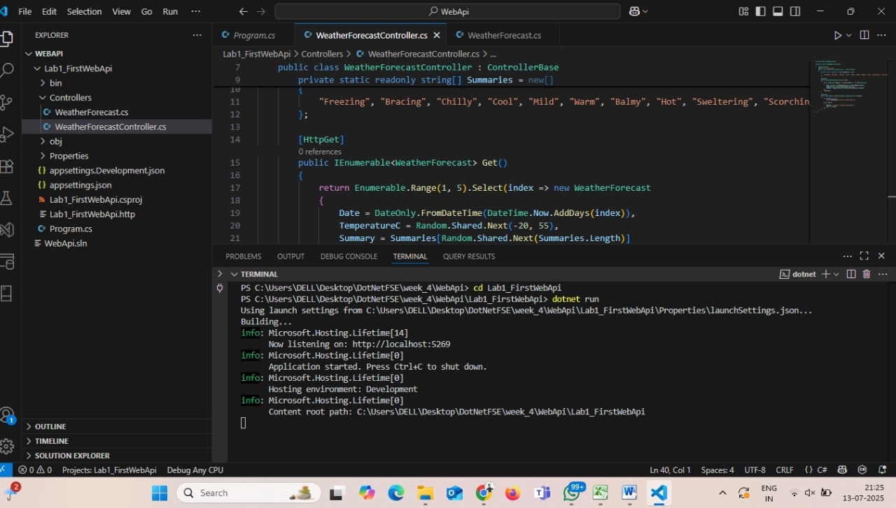
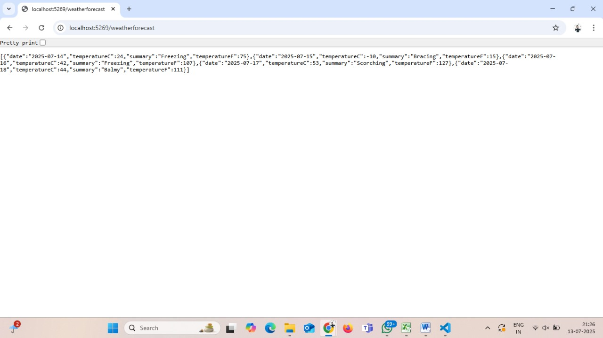

# Lab 1: First Web API using .NET Core

##  Objective:
- Understand RESTful Web APIs and how they work using ASP.NET Core.
- Explore HTTP methods (GET, POST) and API responses.
- Build a simple API with read and write operations.

---

## Goal:
- Create a .NET Core Web API project
- Implement GET and POST methods using action verbs
- Test the endpoints with a browser and Postman
- Understand basic HTTP status codes

---

##  Steps Performed:

1. Created a Web API project using:

2. Opened the project and created `WeatherForecastController.cs` under `Controllers`.

3. Implemented:
- `[HttpGet]` method to return sample weather data
- `[HttpPost]` method to accept weather data in JSON format

4. Created a `WeatherForecast` model class with:
- `Date`, `TemperatureC`, `Summary`, `TemperatureF`

5. Run the project:


6. Tested the GET endpoint in the browser:
https://localhost:5269/weatherforecast


7. Tested the POST endpoint using Postman with sample JSON.

---

##  Endpoints:

###  GET `/weatherforecast`
- Returns a list of randomly generated weather forecasts.

###  POST `/weatherforecast`
- Accepts a JSON weather forecast and returns it back with status `200 OK`.

**Sample POST Body:**

```json
{
"date": "2025-07-20",
"temperatureC": 30,
"summary": "Sunny"
}


---

##  Output

### GET Output Screenshot:



###  POST Output Screenshot:


